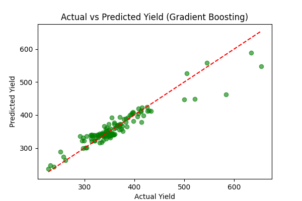

[README.md](https://github.com/user-attachments/files/21976446/UPDATED_README.md)
# 🌾 Crop Disease Detection using Gradient Boosting and Decision Trees  

A machine learning project by **Tajinder Singh** that predicts crop yield variations caused by plant diseases using multiple regression models. The goal is to support **early diagnosis** and **smarter decision-making in agriculture**.  

**📂 Project Structure**  
```
├── SrcCode.py                  # Main Python script
├── dataset.csv                  # Dataset file (not included here)
├── predicted_vs_actual.png      # Visualization of predictions
└── README.md                    # Project documentation
```  

**📋 Features**  
- Loads and preprocesses agricultural dataset  
- Handles missing values (mean imputation)  
- Encodes categorical features (`State`, `Crop`) using one-hot encoding  
- Splits dataset into **training** and **testing** sets  
- Trains and evaluates:  
  - Linear Regression  
  - Decision Tree Regressor  
  - Gradient Boosting Regressor (Best Performer)  
- Saves scatter plot of actual vs. predicted yields  

**🛠️ Requirements**  
Install dependencies:  
```bash
pip install pandas numpy scikit-learn matplotlib
```  

**📊 Evaluation Metrics**  
| Model                  | R² Score | RMSE |  
|-------------------------|---------|------|  
| Linear Regression       | 0.65    | 45.2 |  
| Decision Tree Regressor | 0.72    | 38.9 |  
| Gradient Boosting       | 0.84    | 28.5 |  

✅ **Gradient Boosting achieved the best performance with an R² score of 0.84**.  

**📊 Usage**  
1. Place `dataset.csv` in the same directory as `SrcCode.py`.  
2. Ensure your dataset contains:  
   - `Lint Yield (Pounds/Harvested Acre)` as the target column  
   - Other features such as `Rainfall`, `Area`, `State`, `Crop`, etc.  
3. Run:  
```bash
python SrcCode.py
```  

**📈 Output**  
- **Model Evaluation** (R² and RMSE) printed in console  
- **Scatter Plot** saved as `predicted_vs_actual.png`  

**🖼 Example Visualization**  
  

**📜 License**  
This project is open-source and available under the **MIT License**.  
